# 第一课：摄像机几何

## 一、本节主线

这一课的核心问题是：三维世界中的点，如何经过相机变成二维图像上的点。

完整成像模型可以统一写成：

$$
p^h = K [R \mid t] P_w^h = M P_w^h
$$

其中常用记号统一如下。为了兼容 Markdown 预览，正文里的符号全部使用普通文本写法，不再依赖行内 LaTeX 渲染。

- P_w^h：世界坐标系中的三维点齐次坐标，维度是 4×1。
- [R | t]：外参矩阵，完成世界坐标系到摄像机坐标系的变换，维度是 3×4。
- K：内参矩阵，描述焦距、主点、像素尺度和像素轴夹角，维度是 3×3。
- M：投影矩阵，维度是 3×4。
- p^h：图像点齐次坐标，维度是 3×1。

下文统一约定：

- 标量用 x、y、z、u、v、f。
- 世界坐标系中的三维点记为 P_w。
- 摄像机坐标系中的三维点记为 P_c。
- 理想像平面坐标记为 p_i。
- 像素坐标记为 p。
- 规范化像平面坐标记为 p_n。
- 齐次坐标统一在右上角加 h，例如 P_w^h、P_c^h、p^h。
- 矩阵记为 K、R、M，平移向量记为 t。

---

## 二、针孔摄像机模型

针孔摄像机是最基本的理想成像模型。空间点、光心和像点三者共线，像点由空间点经过光心投影到像平面得到。

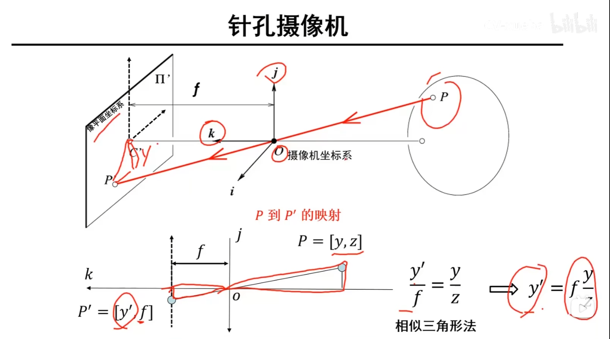

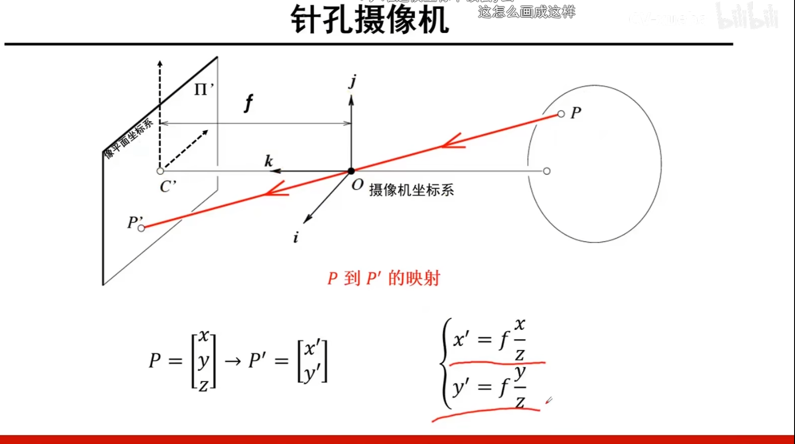

设摄像机坐标系下的空间点为：

$$
P_c =
\begin{bmatrix}
x \\
y \\
z
\end{bmatrix}
$$

它在理想像平面坐标系中的欧式坐标为：

$$
p_i =
\begin{bmatrix}
x' \\
y'
\end{bmatrix}
$$

由相似三角形可得：

$$
x' = f\frac{x}{z}, \qquad y' = f\frac{y}{z}
$$

这里，f 是焦距，z 是点到相机光心沿光轴方向的深度。

可以直接得到几个直观结论：

- 深度 z 越大，像越小，所以会出现“近大远小”。
- 同一条经过光心的空间射线，会落到同一个像点上，因此单目图像通常不能直接恢复绝对深度。
- 为了方便推导，课件中使用的是“虚像平面”，这样图像不会倒置，但数学关系与真实成像完全一致。

---

## 三、理想模型与真实镜头的差异：径向畸变

真实镜头并不完全满足理想针孔模型，最常见的偏差之一就是径向畸变。

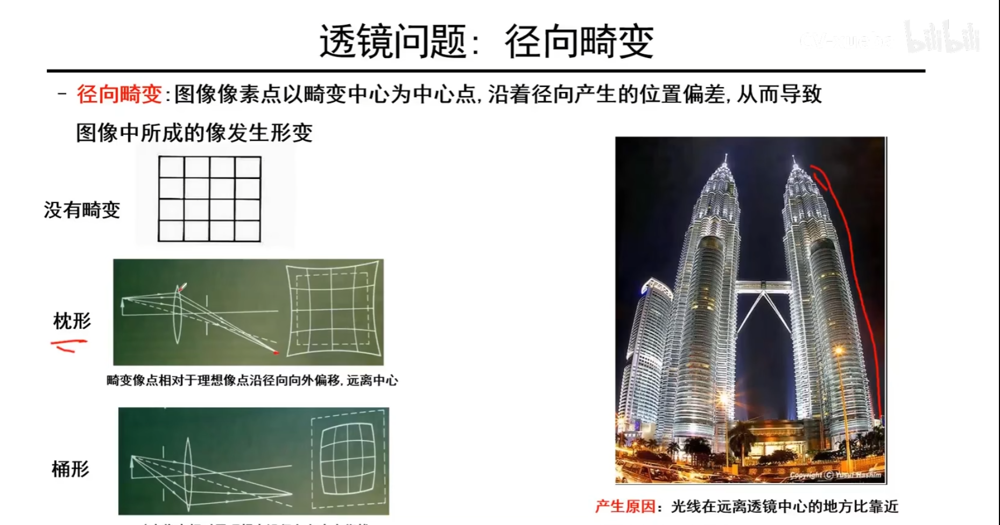

径向畸变的要点：

- 畸变以畸变中心为中心，沿半径方向发生偏移。
- 桶形畸变：边缘点相对理想位置向中心挤压，图像边缘向外鼓。
- 枕形畸变：边缘点相对理想位置向外偏移，图像边缘向内收。
- 在相机标定或视觉算法中，通常先做去畸变，再使用针孔投影模型。

补充：这一节后续大量公式默认建立在“已去畸变的理想针孔模型”上。

---

## 四、为什么透视投影不是线性变换

课件里有一个很重要的问题：从三维点到二维像点的映射，是不是线性的？答案是不是。

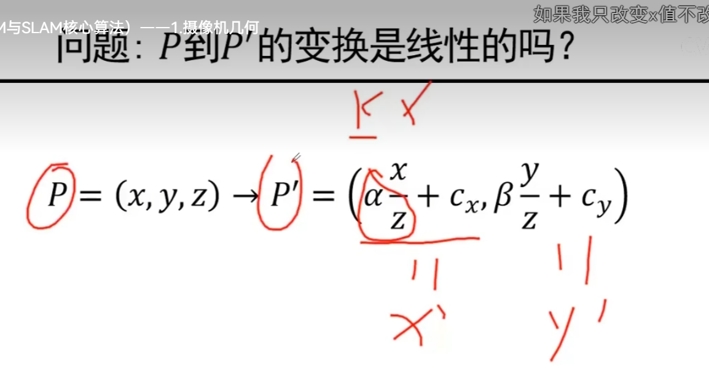

原因就在于分母里的 z：

$$
p =
\begin{bmatrix}
u \\
v
\end{bmatrix}
=
\begin{bmatrix}
\alpha\frac{x}{z} + c_x \\
\beta\frac{y}{z} + c_y
\end{bmatrix}
$$

只要存在“除以 z”，这个映射在欧式坐标下就不是线性的。

更准确地说：

- 如果 z 固定，只在同一个深度平面内看变化，这个映射可以近似看成仿射变换。
- 但对一般三维点而言，z 也在变化，所以从三维空间到二维图像平面的整体映射不是线性的。

这也是为什么计算机视觉里一定要引入齐次坐标。齐次坐标并没有消灭“除法”，而是把它推迟到最后一步统一处理。

---

## 五、齐次坐标

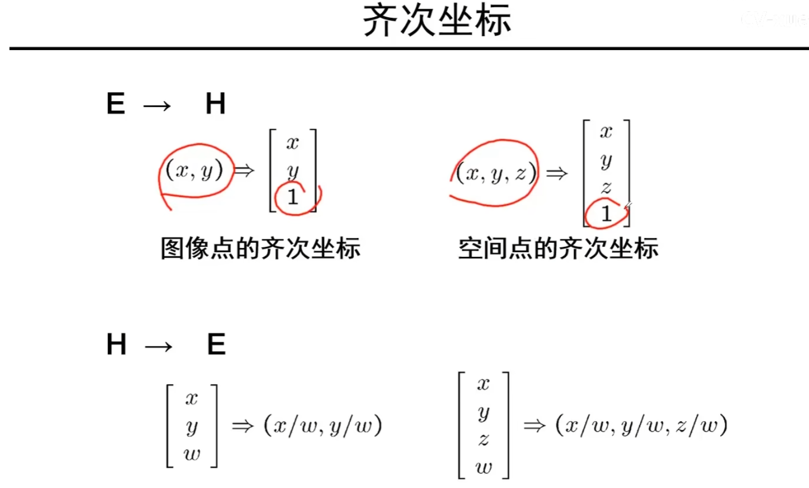

齐次坐标的基本规则：

- 二维欧式点 (u, v) 对应齐次坐标 (u, v, 1)。
- 三维欧式点 (x, y, z) 对应齐次坐标 (x, y, z, 1)。
- 若齐次坐标写成 (u, v, w)，则对应欧式坐标为 (u / w, v / w)。
- 若三维齐次坐标写成 (x, y, z, w)，则对应欧式坐标为 (x / w, y / w, z / w)。

最关键的一点是：

$$
(u,v,w) \sim (\lambda u, \lambda v, \lambda w), \qquad \lambda \neq 0
$$

也就是说，齐次坐标只在比例意义下有意义。这个性质会直接导致投影矩阵只确定到一个非零尺度，因此它不是 12 个自由度，而是 11 个自由度。

---

## 六、齐次坐标中的投影变换

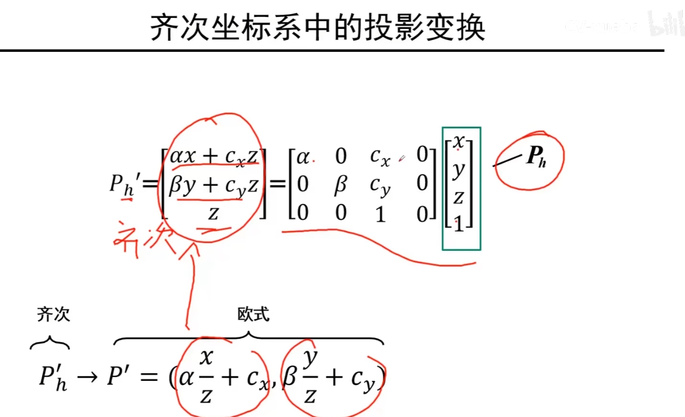

把透视投影写成齐次形式后，可以得到：

$$
p^h =
\begin{bmatrix}
\alpha & 0 & c_x & 0 \\
0 & \beta & c_y & 0 \\
0 & 0 & 1 & 0
\end{bmatrix}
P_c^h
$$

其中：

$$
P_c^h = \begin{bmatrix}x \\ y \\ z \\ 1\end{bmatrix},
\qquad
p^h = \begin{bmatrix}\hat u \\ \hat v \\ \hat w\end{bmatrix}
$$

再做一次去齐次化，得到像素坐标 p：

$$
u = \frac{\hat u}{\hat w} = \alpha\frac{x}{z} + c_x,
\qquad
v = \frac{\hat v}{\hat w} = \beta\frac{y}{z} + c_y
$$

这里：

- (c_x, c_y) 是主点，表示光轴与像平面的交点在像素坐标系中的位置。
- alpha、beta 反映焦距和像素尺度的共同作用，通常可写成 alpha = f k_x、beta = f k_y。

补充理解：

- 在欧式坐标里，透视投影看起来是非线性的。
- 在齐次坐标里，“矩阵乘法”这一步是线性的。
- 真正的非线性体现在最后一步“除以最后一个分量”。

---

## 七、摄像机内参矩阵 K

如果像素坐标轴不完全正交，课件给出的更一般形式为：

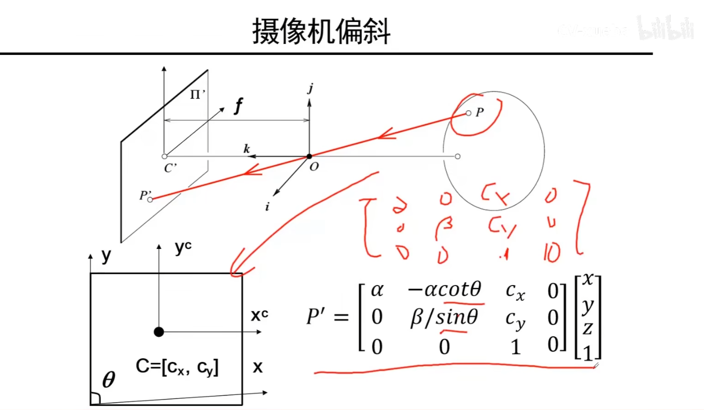

$$
K =
\begin{bmatrix}
\alpha & -\alpha\cot\theta & c_x \\
0 & \beta/\sin\theta & c_y \\
0 & 0 & 1
\end{bmatrix}
$$

其中：

- alpha、beta 描述横纵两个方向上的成像尺度。
- (c_x, c_y) 是主点。
- theta 是像素轴夹角。若像素轴正交，则 theta = 90°。

更常见的教材写法是：

$$
K =
\begin{bmatrix}
f_x & s & c_x \\
0 & f_y & c_y \\
0 & 0 & 1
\end{bmatrix}
$$

其中，s 是 skew 参数。与上式对应关系为：

$$
s = -\alpha\cot\theta,
\qquad
f_x = \alpha,
\qquad
f_y = \beta/\sin\theta
$$

所以内参矩阵本质上有 5 个自由度：

- 横向焦距或尺度参数。
- 纵向焦距或尺度参数。
- 主点横坐标。
- 主点纵坐标。
- skew 或像素轴夹角。

补充：现代大多数工业相机和手机相机的 skew 都非常接近 0，因此常常直接使用简化形式：

$$
K =
\begin{bmatrix}
f_x & 0 & c_x \\
0 & f_y & c_y \\
0 & 0 & 1
\end{bmatrix}
$$

---

## 八、规范化摄像机

如果把内参影响完全去掉，相当于把像点先左乘 K 的逆矩阵，这时得到的就是规范化相机坐标。

规范化摄像机可以理解为一个特殊相机：

$$
K = I
$$

此时投影最简单：

$$
p_n^h = [I \mid 0] P_c^h
$$

对应的欧式坐标就是：

$$
p_n =
\begin{bmatrix}
x_n \\
y_n
\end{bmatrix}
=
\begin{bmatrix}
\frac{x}{z} \\
\frac{y}{z}
\end{bmatrix}
$$

这个视角很重要，因为很多几何推导其实都是先在规范化坐标系中完成，再乘回内参矩阵得到像素坐标。

---

## 九、摄像机外参矩阵 [R | t]

外参矩阵 [R | t] 描述的不是成像尺度，而是“相机在世界中的姿态”。

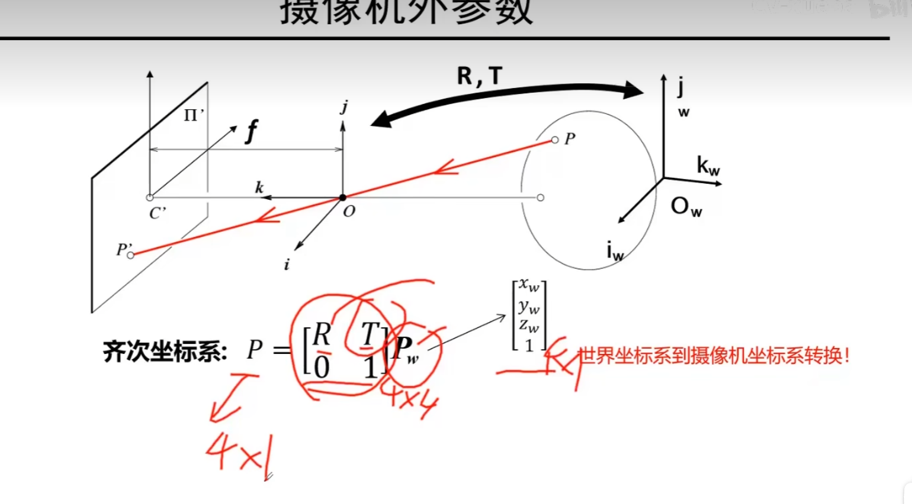

它表示从世界坐标系到摄像机坐标系的刚体变换：

$$
P_c^h =
\begin{bmatrix}
R & t \\
0 & 1
\end{bmatrix}
P_w^h
$$

对应的欧式形式为：

$$
P_c = R P_w + t
$$

其中：

- R 是 3×3 旋转矩阵，3 个自由度。
- t 是 3×1 平移向量，3 个自由度。

一个容易混淆的点：

- 上式是“世界坐标系到摄像机坐标系”的变换。
- 如果已知的是摄像机中心在世界坐标系中的位置 C，那么通常有：

$$
P_c = R(P_w - C) = R P_w - R C
$$

因此：

$$
t = -R C
$$

也就是说，t 不等于摄像机中心本身。

---

## 十、完整的摄像机模型

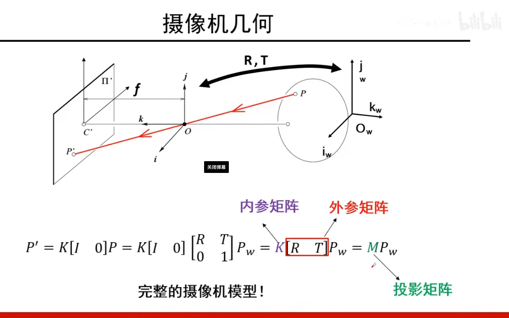

把内参和外参合在一起，就得到完整成像链：

$$
p^h = K [R \mid t] P_w^h = M P_w^h
$$

这条公式可以按“先外后内”的顺序理解：

1. 先用 [R | t] 把世界点变到摄像机坐标系。
2. 再用 K 把摄像机坐标系中的点映射到图像坐标系。
3. 最后对齐次坐标做去齐次化，得到真正的二维像素坐标。

这里的 M = K [R | t] 就叫投影矩阵。

---

## 十一、投影矩阵 M 的自由度

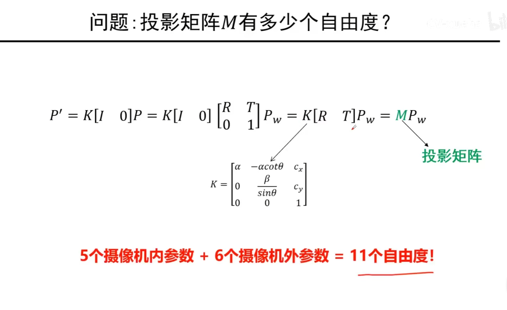

投影矩阵 M 是一个 3×4 矩阵，看起来有 12 个元素，但它只有 11 个自由度。

原因是：

$$
M \sim \lambda M, \qquad \lambda \neq 0
$$

因为齐次坐标只在比例意义下有意义，M 和任意非零倍数的 M 表示同一个投影。

所以：

- 一个一般的 3×4 齐次投影矩阵有 12 - 1 = 11 个自由度。
- 从物理意义上看，也可以拆成：5 个内参自由度 + 6 个外参自由度 = 11 个自由度。

---

## 十二、如何把齐次图像点变回欧式坐标

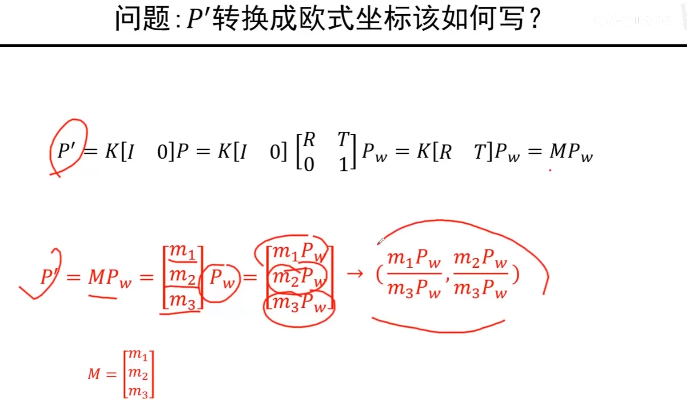

若把投影矩阵写成按行分块的形式：

$$
M =
\begin{bmatrix}
m_1^T \\
m_2^T \\
m_3^T
\end{bmatrix}
$$

则：

$$
p^h = M P_w^h
$$

对应的二维欧式坐标为：

$$
u = \frac{m_1^T P_w^h}{m_3^T P_w^h},
\qquad
v = \frac{m_2^T P_w^h}{m_3^T P_w^h}
$$

其中分母 m_3^T P_w^h 本质上就是去齐次化时使用的尺度项，它与点的深度密切相关。

---

## 十三、投影变换的几何性质

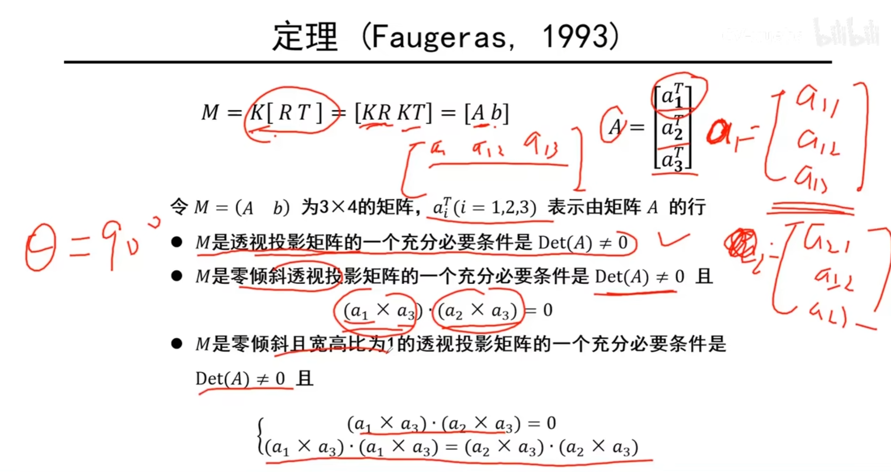

这节课最后要记住的几何现象有：

- 点投影为点。
- 一般情况下，直线投影为直线。
- 近大远小。
- 长度和角度通常不再保持。
- 三维空间中的平行线，在图像中可能相交于灭点或消失点。

补充理解：

- 透视投影不保持长度、角度和面积。
- 但“点在线上”“线与线相交”这类关联关系在射影几何中仍然是有意义的。
- 铁轨在远处看似交于一点，就是灭点最典型的例子。

---

## 十四、常见易错点

1. 主点 (c_x, c_y) 不是三维空间里的“摄像机中心”，它只是光轴在像平面上的落点。
2. 外参 [R | t] 描述的是坐标系变换，不是“镜头参数”。
3. p^h 是三维齐次向量，但对应的图像点欧式坐标只有二维。
4. 单目图像中的一个像点对应一条空间射线，而不是唯一三维点。
5. 投影矩阵 M 不是唯一的，乘上任意非零常数都表示同一个投影。

---

## 十五、复习时的最短记忆链

复习这部分内容时，建议按下面的顺序串起来：

1. 针孔模型给出最基础的透视关系：x' = fx / z，y' = fy / z。
2. 因为存在除以 z，所以欧式坐标下的投影不是线性的。
3. 引入齐次坐标后，可以把投影写成矩阵乘法加最后一次去齐次化。
4. K 管“相机内部如何成像”，[R | t] 管“相机相对世界在哪里”。
5. 完整公式就是：p^h = K [R | t] P_w^h。

---

## 十六、延伸阅读

- [附录：最小二乘问题](../附录-最小二乘问题/最小二乘.md)：当把投影关系写成参数估计问题时，通常会落到线性最小二乘、齐次最小二乘或非线性最小二乘。后续学习 DLT、PnP、相机标定和 Bundle Adjustment 时，这套框架会反复出现。

---

## 附录 A：课堂截图归档

下面这些截图保留作为原课件参考，和上面的整理版内容互相对应。

### A.1 投影矩阵的基础写法

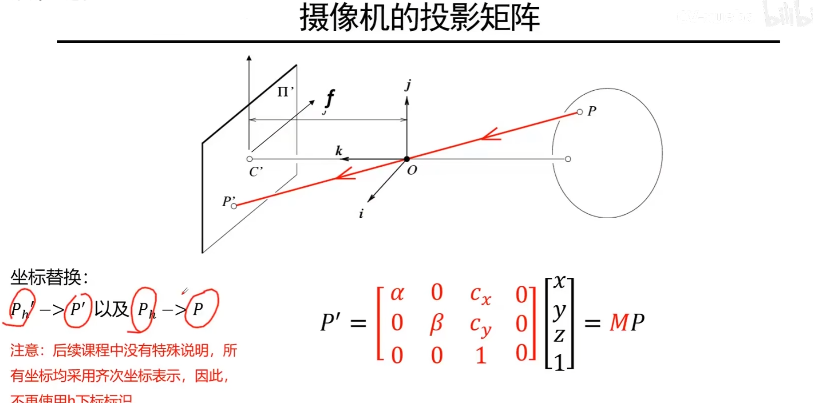

### A.2 摄像机坐标系下的摄像机模型

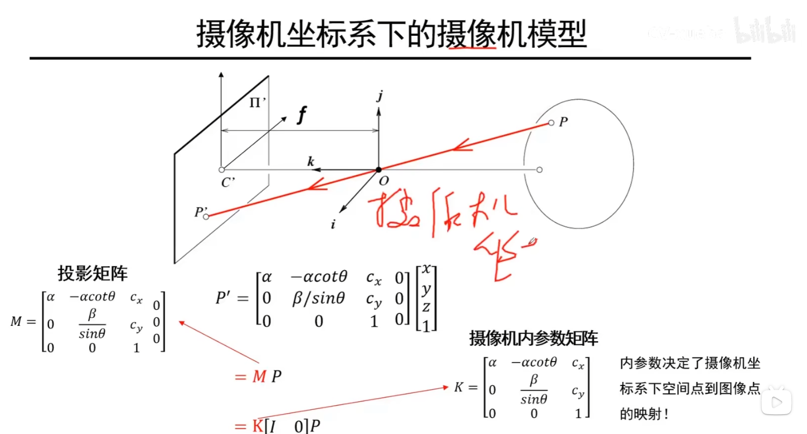

### A.3 规范化摄像机

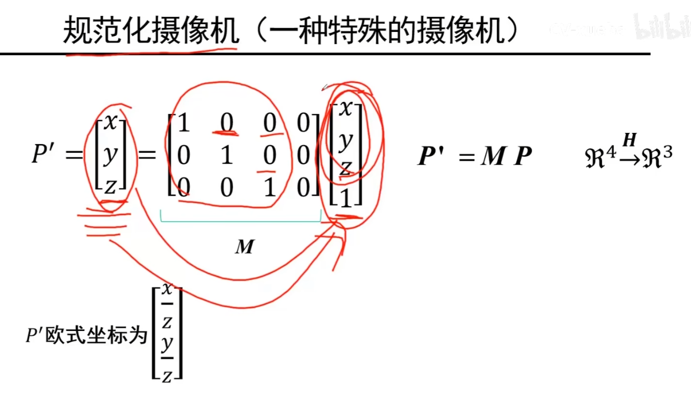

### A.4 各个符号的物理意义与维度

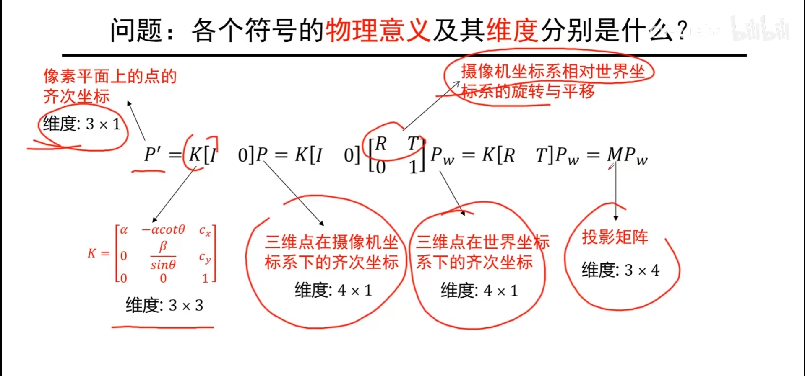

### A.5 投影矩阵的高级性质

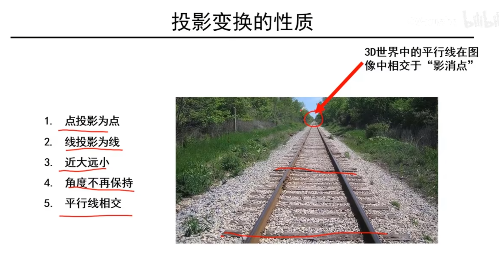

补充一句：如果把 M 写成 M = [A | b]，则非退化透视投影至少要求 det(A) ≠ 0。更进一步的零 skew、单位宽高比等条件，会对应更细的代数约束。这部分通常在相机标定和多视图几何里再深入。

---

## 附录 B：手写整理归档

### B.1 手写整理 1

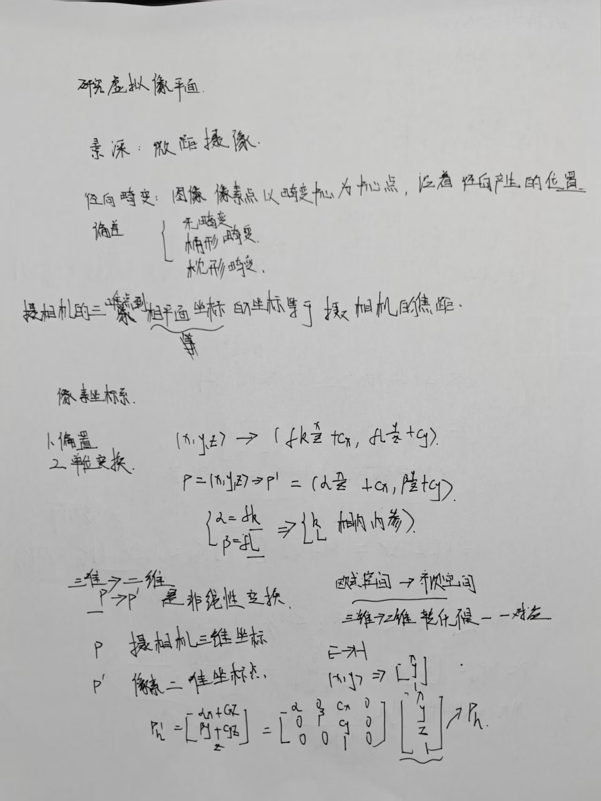

### B.2 手写整理 2

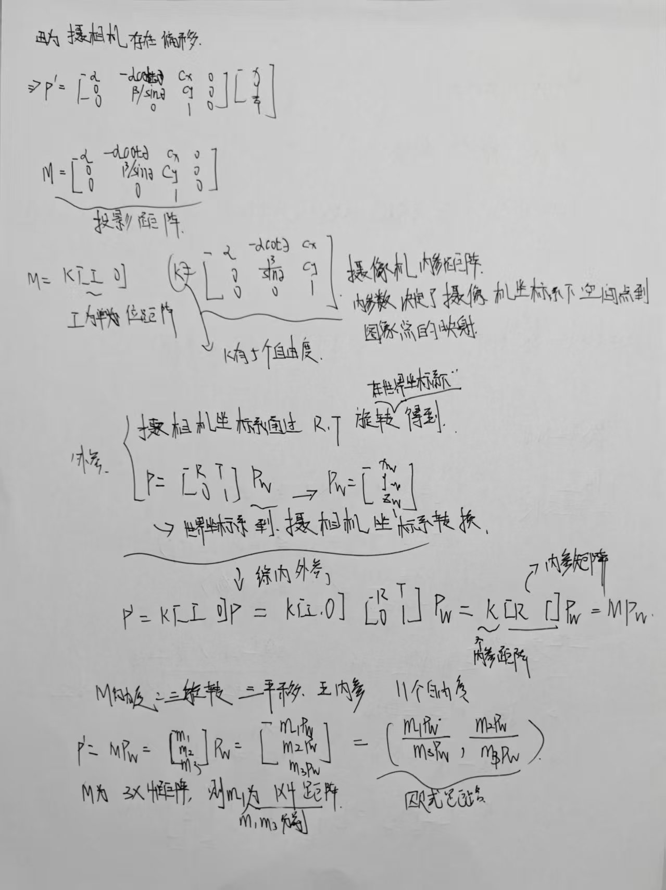
