# 第三课：单视图几何

## 1. 本课主线

单视图几何研究的是：仅从一张图像中，利用投影几何约束恢复场景中的几何信息。  
它的核心思想是把“图像中的点、线、角度、平行关系”统一到射影几何框架下处理。

这一课可以概括为四条主线：

1. 用齐次坐标统一描述点与直线
2. 用矩阵描述 2D 平面上的欧式、仿射与投影变换
3. 用无穷远点、无穷远线解释平行线为何在图像中相交
4. 利用影消点、影消线和绝对二次曲线进行单视图标定

---

## 2. 齐次坐标与射影平面基础

### 2.1 为什么要引入齐次坐标

在普通二维欧氏平面中，一个点通常写成 (x, y)。  
但透视投影不是线性变换，而齐次坐标可以把透视投影写成线性形式，便于统一处理。

二维点的齐次表示为：

$$
\mathbf{x} = [x, y, w]^T
$$

其中：

- 当 w != 0 时，对应有限点，欧氏坐标为 (x / w, y / w)
- 当 w = 0 时，对应无穷远点
- 任意非零比例都表示同一个点，即

$$
[x, y, w]^T \sim [\lambda x, \lambda y, \lambda w]^T, \quad \lambda \neq 0
$$

### 2.2 直线的齐次表示

二维直线可表示为：

$$
\mathbf{l} = [a, b, c]^T
$$

点在线上的条件是：

$$
\mathbf{l}^T \mathbf{x} = ax + by + cw = 0
$$

若 w = 1，则退化为熟悉的欧氏形式：

$$
ax + by + c = 0
$$

### 2.3 点线对偶

射影几何中存在非常重要的对偶关系：

- 两点确定一条直线
- 两线确定一个交点

具体公式如下：

$$
\mathbf{l} = \mathbf{x}_1 \times \mathbf{x}_2
$$

$$
\mathbf{x} = \mathbf{l}_1 \times \mathbf{l}_2
$$

这里的叉乘在实际计算中非常常用，尤其适合求交点与连线。

---

## 3. 2D 平面上的几类变换

平面上的一般单应变换写成：

$$
\mathbf{x}' \sim H \mathbf{x}, \quad H \in \mathbb{R}^{3 \times 3}, \det(H) \neq 0
$$

根据约束强弱不同，常见分为以下几类。

### 3.1 欧式变换（Euclidean Transform）

欧式变换保持距离和角度不变，本质是旋转加平移。

$$
\mathbf{x}' = R\mathbf{x} + t
$$

齐次形式：

$$ [x', y', 1]^T = [[R, t], [0^T, 1]] [x, y, 1]^T $$

其中二维旋转矩阵为：

$$
R =
\begin{bmatrix}
\cos\theta & -\sin\theta \\
\sin\theta & \cos\theta
\end{bmatrix}
$$

性质：

- 保持长度
- 保持夹角
- 保持平行关系
- 保持无穷远线不变

### 3.2 相似变换（Similarity Transform）

相似变换在欧式变换基础上加入统一尺度缩放：

$$
\mathbf{x}' = sR\mathbf{x} + t
$$

性质：

- 保持角度
- 保持形状相似性
- 不保持绝对长度，但长度比在同方向上保持

### 3.3 仿射变换（Affine Transform）

仿射变换的齐次矩阵形式为：

$$
H_A =
\begin{bmatrix}
A & t \\
0^T & 1
\end{bmatrix}
$$

其中，A 为任意可逆的 2 x 2 矩阵。

性质：

- 保持直线
- 保持共线性
- 保持平行关系
- 不保持角度和长度
- 保持无穷远线不变

这里的无穷远线记为：

$$
\mathbf{l}_{\infty}
$$

所以，仿射变换的一个关键特征就是：平行线经过变换后仍平行。

### 3.4 投影变换 / 单应变换（Projective Transform / Homography）

最一般的平面变换写为：

$$
H =
\begin{bmatrix}
A & t \\
v^T & b
\end{bmatrix}
$$

其中最后一行中的 $v^T$ 决定了是否引入透视效应。

性质：

- 保持直线
- 保持交比
- 不保持平行
- 不保持长度和角度

如果 v != 0，则无穷远点会被映射到有限点，平行线在图像中相交，这就是透视现象的来源。

#### 本节课件图示

下面这些截图对应本章关于欧式、相似、仿射和投影变换的讲解，可以和上面的文字笔记对照着看。

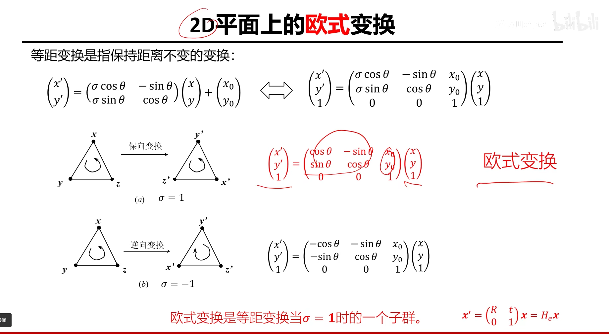

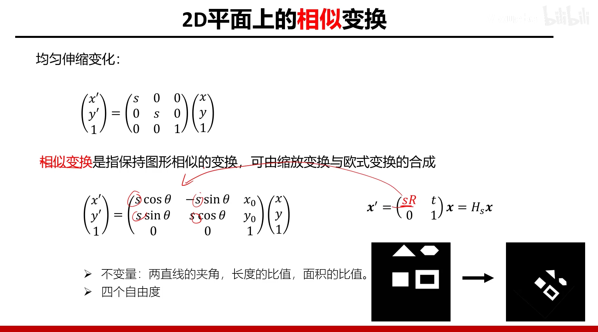

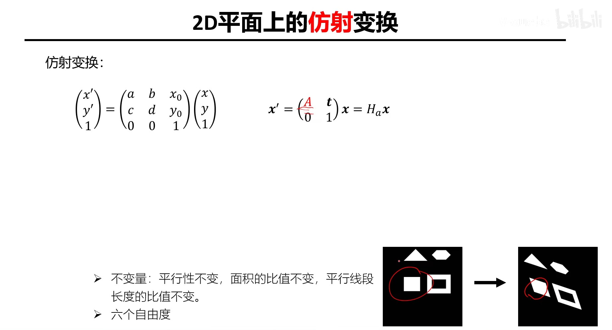

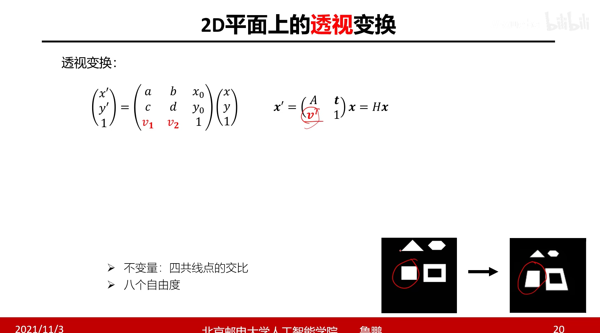

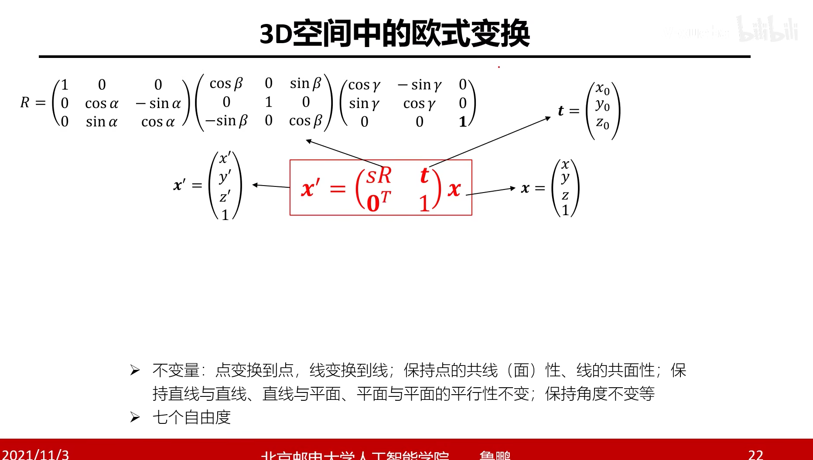

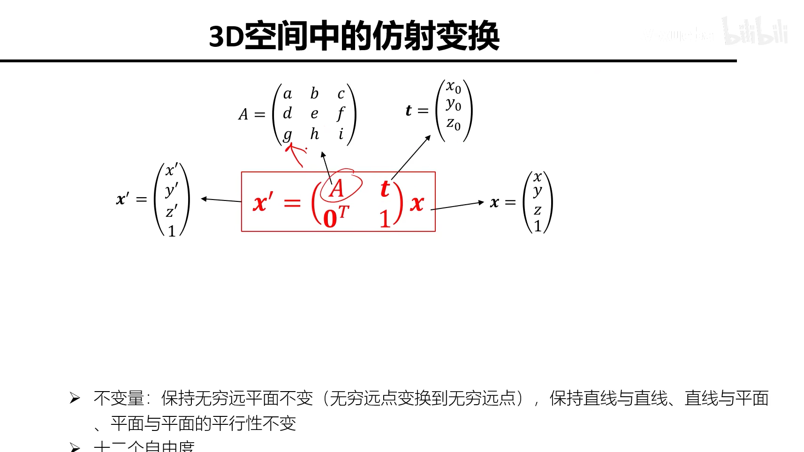

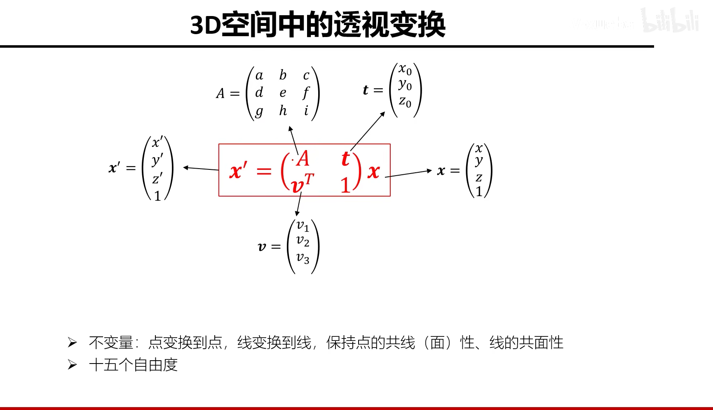

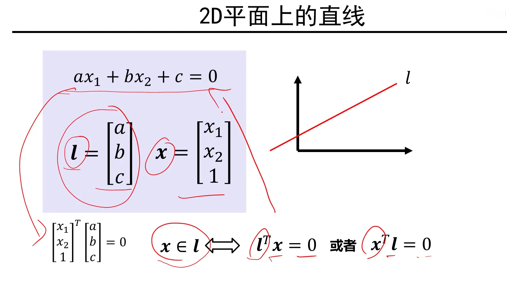

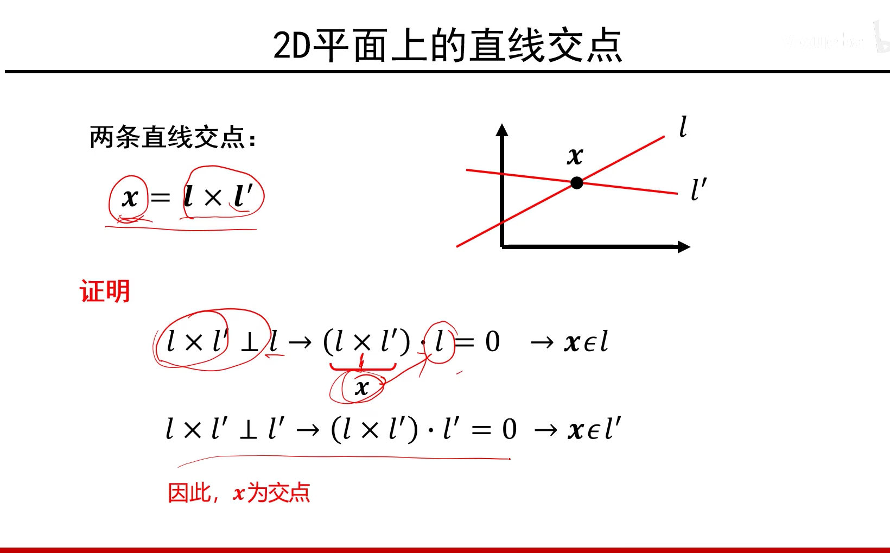

---

## 4. 无穷远点与无穷远线

### 4.1 无穷远点

二维平面中，所有方向都可以由一个无穷远点表示：

$$
\mathbf{x}_{\infty} =
\begin{bmatrix}
d_x \\
d_y \\
0
\end{bmatrix}
$$

其中

$$
\mathbf{d} =
\begin{bmatrix}
d_x \\
d_y
\end{bmatrix}
$$

表示这个无穷远点对应的二维方向。

直观理解：

- 一组平行线共享同一个方向
- 这组平行线在射影平面中相交于一个无穷远点

### 4.2 无穷远线

二维平面中所有无穷远点构成一条特殊的直线，称为无穷远线：

$$
\mathbf{l}_{\infty} =
\begin{bmatrix}
0 \\
0 \\
1
\end{bmatrix}
$$

因为任意无穷远点

$$
\mathbf{x}_{\infty} =
\begin{bmatrix}
x \\
y \\
0
\end{bmatrix}
$$

都满足：

$$
\mathbf{l}_{\infty}^{T} \mathbf{x}_{\infty} =
\begin{bmatrix}
0 & 0 & 1
\end{bmatrix}
\begin{bmatrix}
x \\
y \\
0
\end{bmatrix}
= 0
$$

所以无穷远线可以看作“所有方向的集合”。

### 4.3 无穷远点在不同变换下的表现

对点的变换有：

$$
\mathbf{p}' \sim H\mathbf{p}
$$

若

$$
\mathbf{p}_{\infty} =
\begin{bmatrix}
d_x \\
d_y \\
0
\end{bmatrix}
$$

则：

- 在仿射变换下，

$$ \mathbf{p}_{\infty}' \sim H_A \mathbf{p}_{\infty} = [A[d_x, d_y]^T, 0]^T $$

因此第三个分量仍为 0，所以它仍然是无穷远点。

- 在一般投影变换下，第三坐标可能不为 0，因此会变成有限点

$$ \mathbf{p}_{\infty}' \sim H \mathbf{p}_{\infty} = [A[d_x, d_y]^T, v^T[d_x, d_y]^T]^T $$

如果 v != 0，那么最后一个分量一般不为 0，因此无穷远点会被映射到有限点。平行线在图像中相交，这就是透视现象的来源。

这正解释了为什么：

- 仿射变换保平行
- 投影变换不保平行

### 4.4 无穷远线在不同变换下的表现

直线的变换公式为：

$$
\mathbf{l}' \sim H^{-T} \mathbf{l}
$$

因此：

- 在仿射变换下，无穷远线仍映射到自身，也就是说它仍然是一条无穷远线
- 在一般投影变换下，无穷远线会变成一条普通有限直线

图像中的这条有限直线，就是场景平面在图像中的影消线。

#### 本节课件图示

下面这些截图对应无穷远点、无穷远线以及点线变换关系。

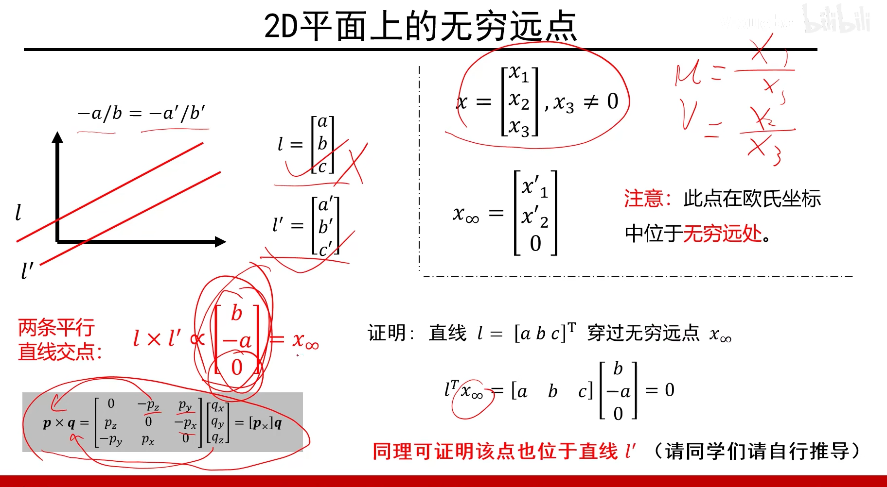

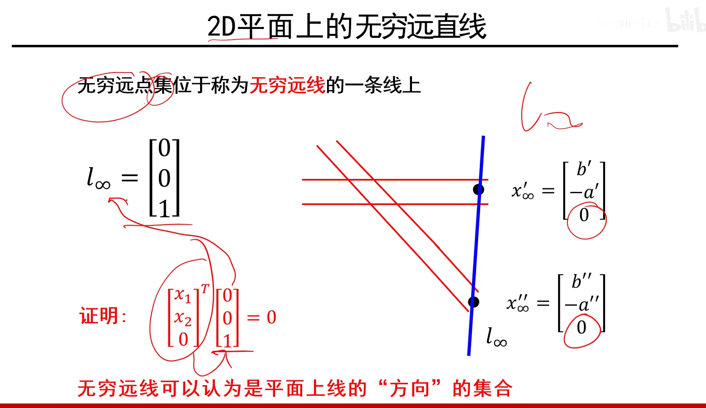

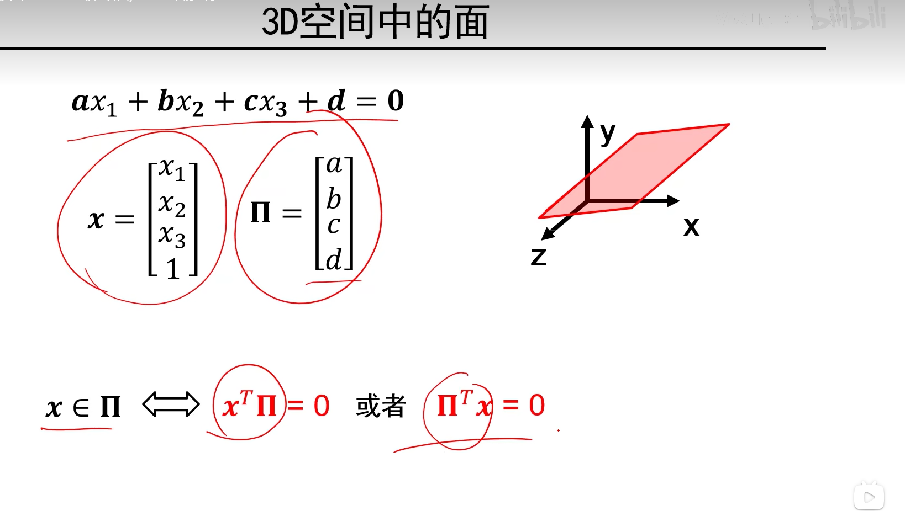

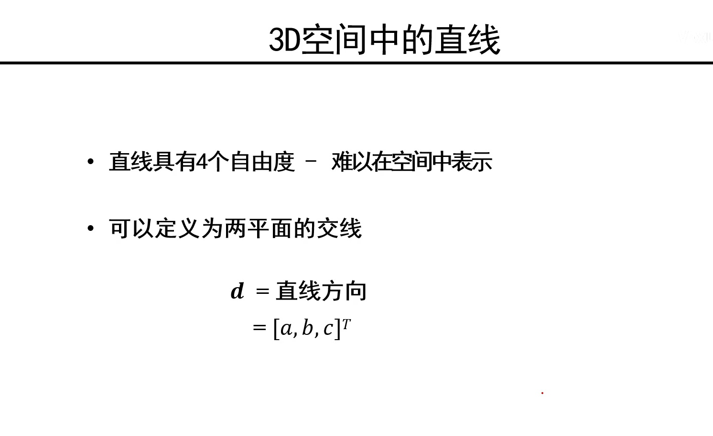

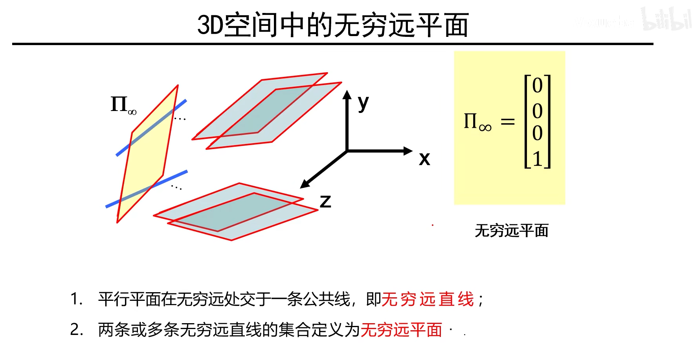

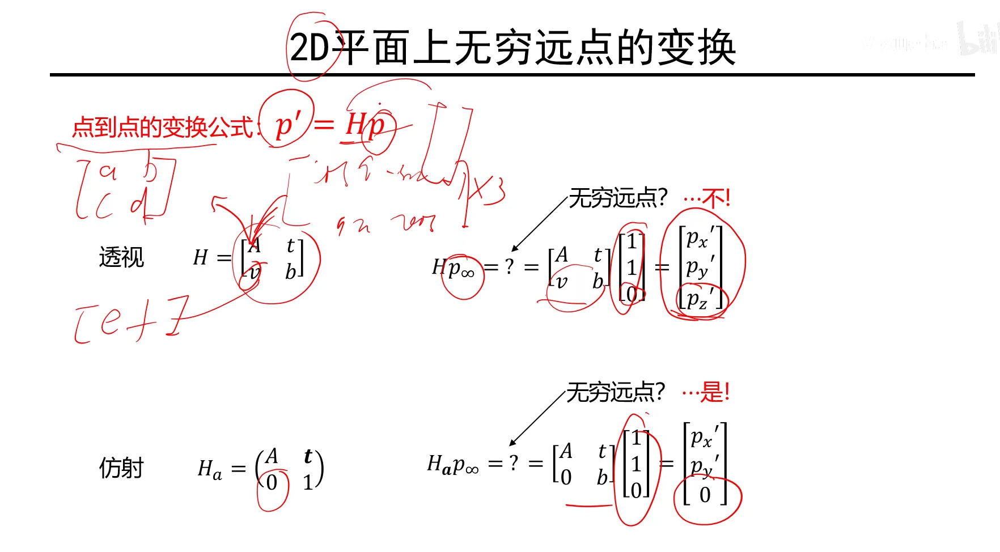

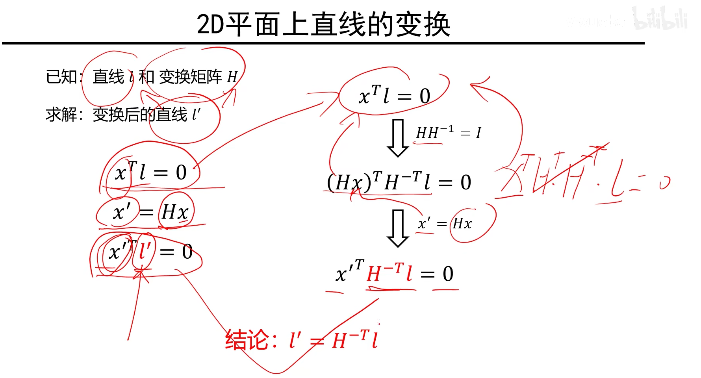

---

## 5. 影消点、影消线与透视直觉

### 5.1 影消点

空间中一组互相平行的直线，在图像平面上往往相交于一点，这个点称为影消点。

如果空间方向向量为：

$$
\mathbf{d} = [a, b, c]^T
$$

其对应的无穷远点为：

$$
\mathbf{X}_{\infty} = [a, b, c, 0]^T
$$

相机投影矩阵写为：

$$
P = K[R \mid t]
$$

则该方向在图像中的影消点满足：

$$
\mathbf{v} \sim P\mathbf{X}_{\infty}
$$

若以相机坐标系描述方向，则常写成：

$$
\mathbf{v} \sim K\mathbf{d}
$$

因此可以恢复方向：

$$
\mathbf{d} = \frac{K^{-1}\mathbf{v}}{\lVert K^{-1}\mathbf{v} \rVert}
$$

### 5.2 影消线

如果考虑空间中的一个平面，其上所有方向对应的影消点构成一条线，称为该平面的影消线，也叫地平线、天际线或 horizon line。

这个平面通常记为：

$$
\pi
$$

若平面法向量记为

$$
\mathbf{n}
$$

则影消线与法向量存在关系：

$$
\mathbf{n} \sim K^T \mathbf{l}_h
$$

或写成：

$$
\mathbf{l}_h \sim K^{-T}\mathbf{n}
$$

这说明：

- 平面的法向量决定其影消线
- 影消线刻画了该平面上所有平行方向的像

在自动驾驶场景里，道路平面常常有一条稳定的影消线，因此这部分内容非常重要。

### 5.3 交比在透视中的不变性

虽然长度和角度在透视投影下通常不保持，但交比保持不变。对于同一直线上的四点 $A,B,C,D$，交比定义为：

$$
(A,B;C,D) = \frac{AC/BC}{AD/BD}
$$

交比是射影不变量，因此可以用于单视图测量和恢复比例关系。

#### 本节课件图示

下面这些截图对应影消点、影消线、方向恢复以及角度关系。

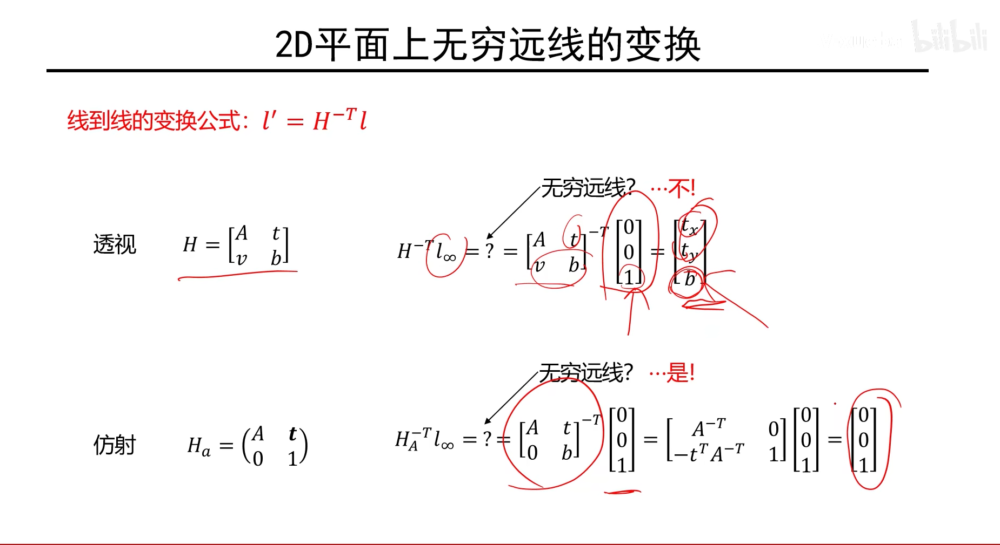

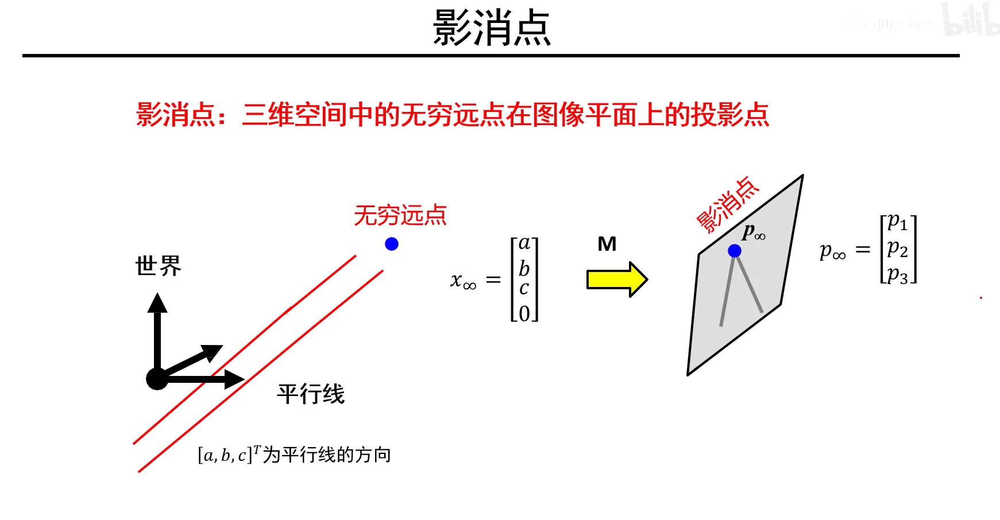

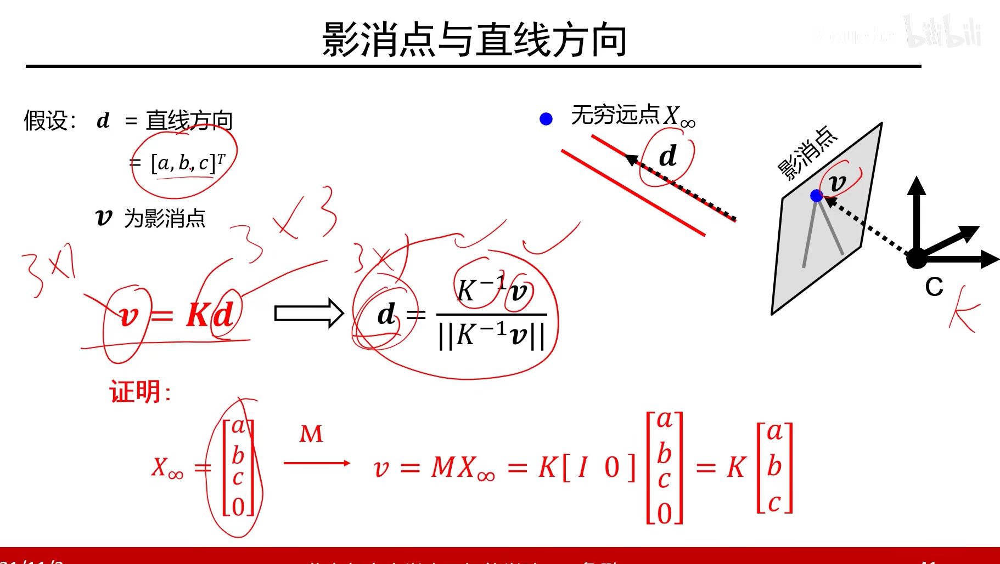

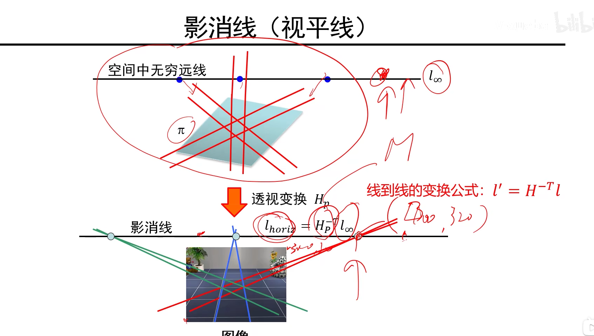

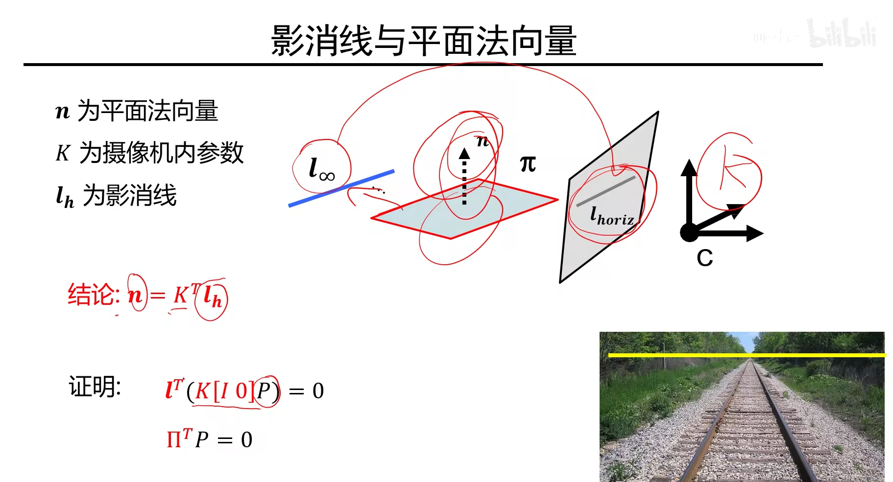

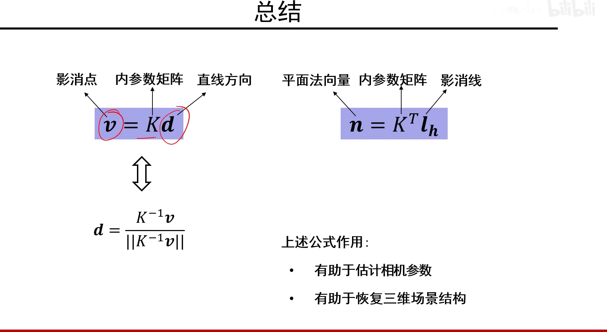

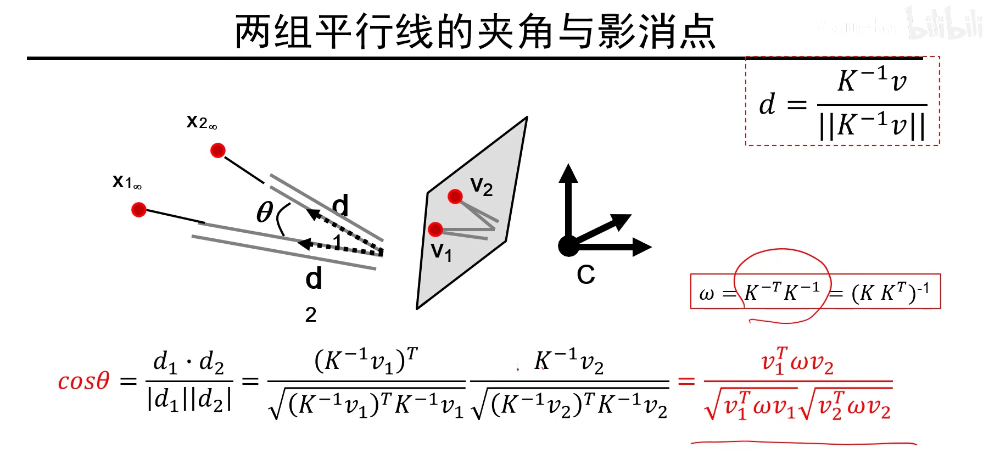

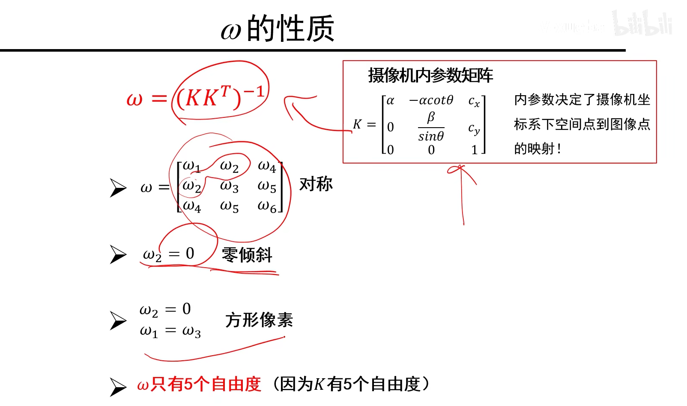

---

## 6. 绝对二次曲线与单视图标定

### 6.1 为什么标定和影消点有关

相机内参矩阵决定了图像坐标和相机坐标之间的关系。

这里把相机内参矩阵记为：

$$
K
$$

如果知道若干组空间正交方向对应的影消点，就能写出关于 K 的约束，从而完成相机标定。

这里会用到像绝对二次曲线（Image of the Absolute Conic, IAC）：

$$
\omega = K^{-T}K^{-1} = (KK^T)^{-1}
$$

它是一个对称矩阵，一般写成：

$$
\omega =
\begin{bmatrix}
\omega_1 & \omega_2 & \omega_4 \\
\omega_2 & \omega_3 & \omega_5 \\
\omega_4 & \omega_5 & \omega_6
\end{bmatrix}
$$

由于对称性，只有 5 个自由度；再考虑尺度不定，实际可看作 5 个独立参数对应内参的 5 个自由度。

### 6.2 正交方向带来的约束

设两组空间方向对应的影消点分别为：

$$
\mathbf{v}_1, \mathbf{v}_2
$$

若这两组方向在空间中互相正交，则有：

$$
\mathbf{v}_1^T \omega \mathbf{v}_2 = 0
$$

更一般地，若两组方向夹角记为 theta，则有：

$$
\cos\theta =
\frac{\mathbf{v}_1^T \omega \mathbf{v}_2}
{\sqrt{\mathbf{v}_1^T \omega \mathbf{v}_1}\sqrt{\mathbf{v}_2^T \omega \mathbf{v}_2}}
$$

这个公式的意义非常大：

- 若已知两组线互相垂直，则得到零约束
- 若已知夹角，则得到一般角度约束
- 多组约束联立后，就可以估计

$$
\omega
$$

进而恢复

$$
K
$$

### 6.3 单视图标定的典型假设

单张图像中，通常约束不足，所以经常引入以下先验：

- 零倾斜：图像坐标轴正交，即 skew 为 0
- 正方形像素：通常写成

$$
f_x = f_y
$$

或者已知像素长宽比。

- 主点位于图像中心附近
- 场景中存在三组互相正交方向，如建筑立面

例如当图像中能找出三组正交方向对应的影消点时，可记为：

$$
\mathbf{v}_1, \mathbf{v}_2, \mathbf{v}_3
$$

此时可列出：

$$
\mathbf{v}_1^T \omega \mathbf{v}_2 = 0
$$

$$
\mathbf{v}_1^T \omega \mathbf{v}_3 = 0
$$

$$
\mathbf{v}_2^T \omega \mathbf{v}_3 = 0
$$

再结合零倾斜和正方形像素假设，通常就足以求解 K。

#### 本节课件图示

下面这些截图对应单视图标定、重构示例和本课总结。

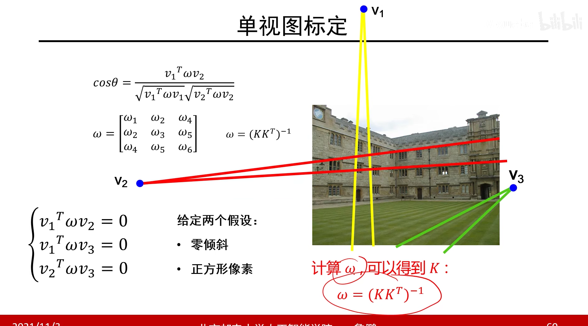

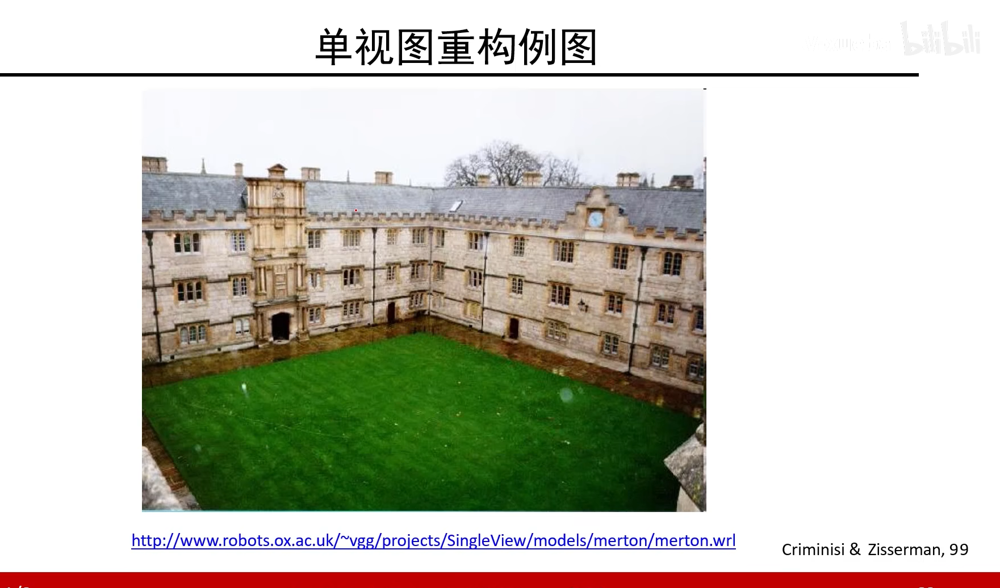

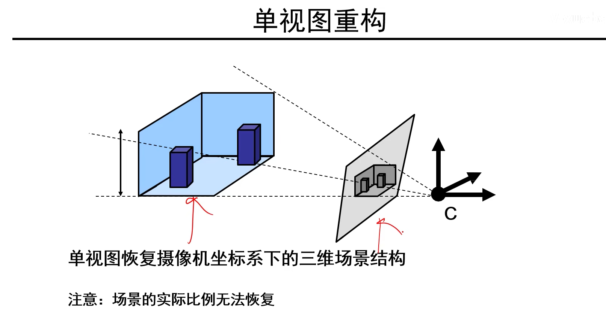

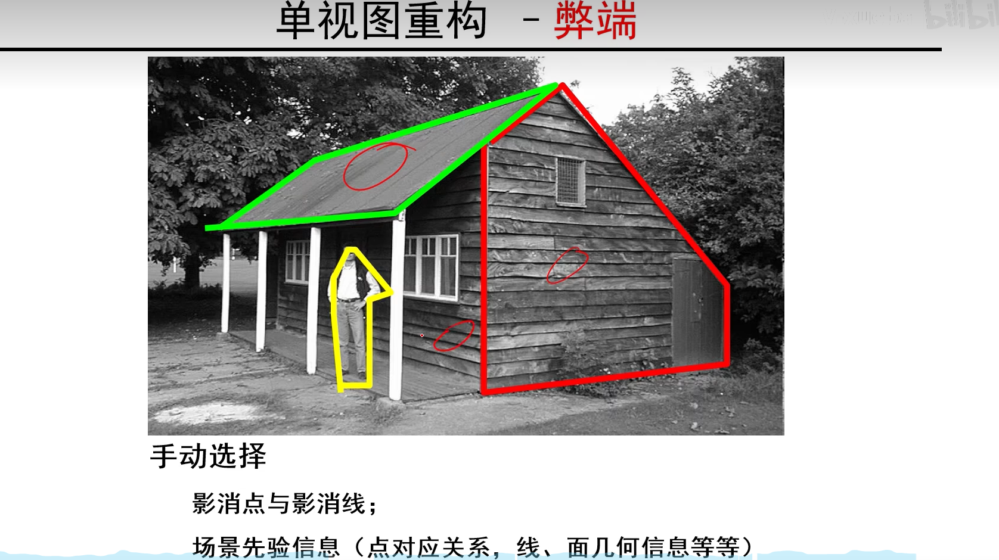

---

## 7. 从几何恢复到单视图测量

### 7.1 单视图几何常做什么

单视图几何常见任务包括：

- 从一张图中估计相机内参
- 估计道路或墙面的法向量
- 估计地平线位置
- 通过平面单应进行逆透视映射（IPM）
- 利用已知参考物恢复长度、宽度或高度

### 7.2 在自动驾驶中的典型用途

在自动驾驶任务里，这部分内容经常直接对应以下操作：

1. 车道线延长线求交，估计道路主方向影消点
2. 由多组平行边界估计地平线或道路影消线
3. 通过道路平面单应将前视图转换为鸟瞰图
4. 由影消线估计相机俯仰角
5. 利用已知物体尺度进行单目距离或高度估计

### 7.3 逆透视映射（IPM）的联系

若已知某个场景平面（如地面）的单应矩阵 $H$，则图像点与地面坐标之间满足：

$$
\mathbf{x}_{ground} \sim H\mathbf{x}_{image}
$$

这就是很多道路检测、车道线检测中使用的逆透视映射基础。

---

## 8. 一套实用的解题框架

### 8.1 看到题目先判断哪类信息是已知的

通常题目会给出以下几类信息：

- 平行关系
- 垂直关系
- 已知夹角
- 已知长度比或共线点
- 已知平面

不同信息对应不同工具：

- 平行关系 -> 影消点、影消线
- 垂直关系 -> 使用正交约束，即“v1 的转置乘以 omega，再乘以 v2，结果等于 0”
- 已知夹角 -> 角度约束公式
- 长度比 -> 交比不变
- 已知平面 -> 单应矩阵

### 8.2 解题步骤建议

1. 先在图中找出明显的平行线组
2. 由平行线求影消点
3. 由多个影消点求影消线
4. 用正交约束估计 omega 或 K
5. 再进一步恢复方向、法向量、角度或长度

这类题目最怕一上来就直接代公式。先判断“该约束属于平行、垂直还是共面”，会清楚很多。

---

## 9. 易错点总结

### 9.1 仿射变换和投影变换不要混淆

- 仿射变换保持平行关系
- 投影变换一般不保持平行关系
- 是否保持无穷远线，是区分两者的关键

### 9.2 点和线的变换公式不同

点：

$$
\mathbf{x}' \sim H\mathbf{x}
$$

线：

$$
\mathbf{l}' \sim H^{-T}\mathbf{l}
$$

这两个公式非常容易写反。

### 9.3 影消点不是“真实场景中的点”

影消点更准确地说，是某一方向的无穷远点在图像上的投影。  
它表达的是方向信息，而不是某个真实有限位置。

### 9.4 角度约束依赖内参

图像中的两条线看起来垂直，不代表空间中一定垂直；必须通过内参矩阵 K 或 IAC 矩阵 omega，才能把图像关系转换为空间角度关系。

### 9.5 单张图像的约束通常不够

单视图标定很多时候需要附加假设，例如：

- 零倾斜
- 正方形像素
- 主点已知或近似已知
- 场景存在曼哈顿结构

否则问题往往欠定。

---

## 10. 一页速记版

### 10.1 核心表示

- 点：

$$
\mathbf{x} = [x, y, w]^T
$$

- 线：

$$
\mathbf{l} = [a, b, c]^T
$$

- 点在线上：

$$
\mathbf{l}^T \mathbf{x} = 0
$$

- 两点成线：

$$
\mathbf{l} = \mathbf{x}_1 \times \mathbf{x}_2
$$

- 两线交点：

$$
\mathbf{x} = \mathbf{l}_1 \times \mathbf{l}_2
$$

### 10.2 变换公式

- 点变换：

$$
\mathbf{x}' \sim H\mathbf{x}
$$

- 线变换：

$$
\mathbf{l}' \sim H^{-T}\mathbf{l}
$$

- 仿射矩阵：

$$
H_A = \begin{bmatrix} A & t \\ 0^T & 1 \end{bmatrix}
$$

- 一般单应：

$$
H = \begin{bmatrix} A & t \\ v^T & b \end{bmatrix}
$$

### 10.3 无穷远对象

- 无穷远点：

$$
\mathbf{x}_{\infty} = [d_x, d_y, 0]^T
$$

- 无穷远线：

$$
\mathbf{l}_{\infty} = [0, 0, 1]^T
$$

- 仿射变换保持无穷远线
- 投影变换一般不保持无穷远线

### 10.4 影消几何

- 方向到影消点：

$$
\mathbf{v} \sim K\mathbf{d}
$$

- 恢复方向：

$$
\mathbf{d} = \dfrac{K^{-1}\mathbf{v}}{\lVert K^{-1}\mathbf{v} \rVert}
$$

- 平面法向量与影消线：

$$
\mathbf{n} \sim K^T\mathbf{l}_h
$$

### 10.5 标定公式

- IAC：

$$
\omega = K^{-T}K^{-1} = (KK^T)^{-1}
$$

- 正交约束：

$$
\mathbf{v}_1^T\omega\mathbf{v}_2 = 0
$$

- 角度约束：

$$
\cos\theta =
\frac{\mathbf{v}_1^T \omega \mathbf{v}_2}
{\sqrt{\mathbf{v}_1^T \omega \mathbf{v}_1}\sqrt{\mathbf{v}_2^T \omega \mathbf{v}_2}}
$$

---

