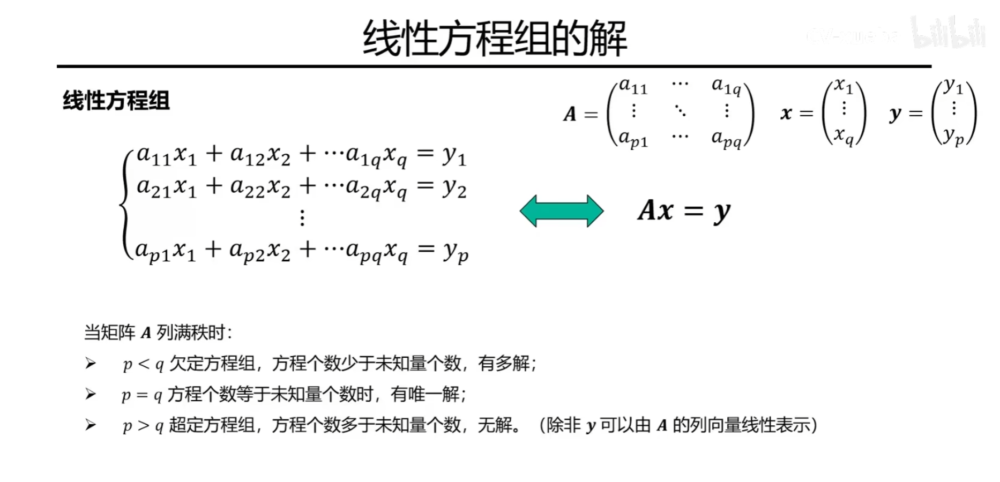
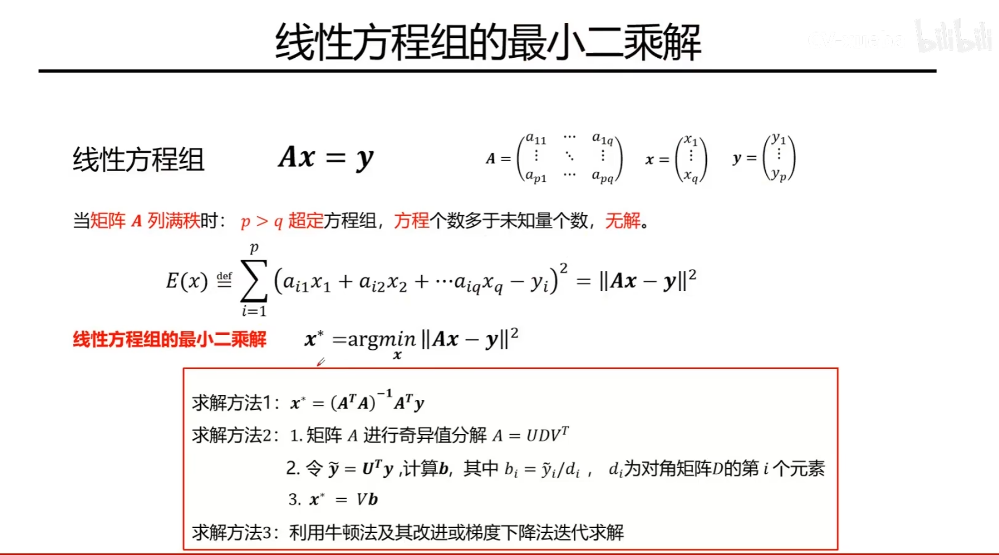
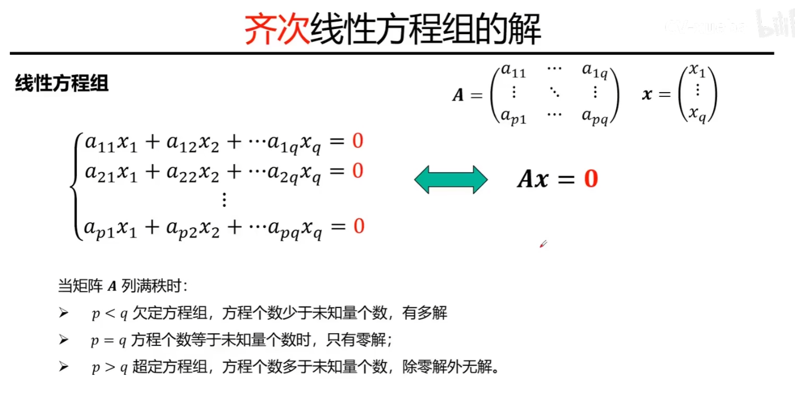
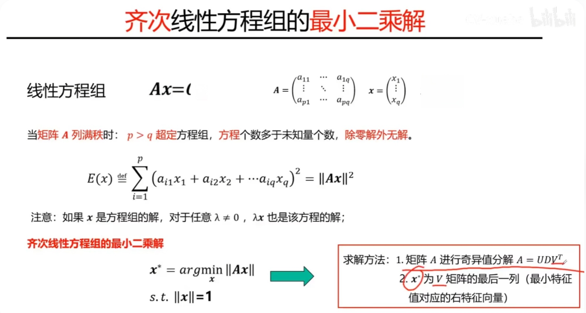
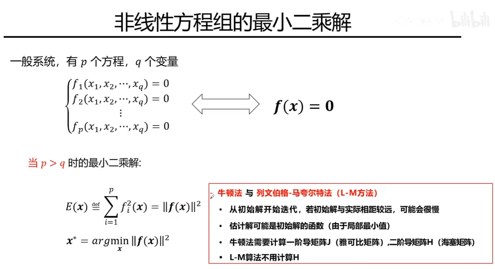

# 附录：最小二乘问题

## 一、这个附录解决什么

在计算机视觉里，观测通常带噪声，而且方程个数往往多于未知量个数。此时我们很难找到一个“严格满足所有方程”的精确解，更常见的做法是寻找一个让残差尽可能小的近似解，这就是最小二乘问题。

这个附录和前面的课程关系如下：

- 前置笔记是 [第一课：摄像机几何](../第一课-摄像机几何/第一课-摄像机几何.md)，里面已经引入了投影矩阵、齐次坐标和世界点到像点的成像关系。
- 当我们把这些几何关系写成方程组去估计参数时，就会自然落到线性最小二乘、齐次最小二乘或非线性最小二乘。
- 后续常见场景包括 DLT、单应矩阵估计、基础矩阵估计、PnP 位姿求解、相机标定和 Bundle Adjustment。

---

## 二、从线性方程组到最小二乘

先看最普通的线性方程组：

$$
Ax = y
$$

其中：

- A 是 p x q 的系数矩阵。
- x 是 q x 1 的未知向量。
- y 是 p x 1 的观测向量。

当矩阵 A 列满秩时，可以按方程个数和未知量个数的关系粗略分成三类：

- p < q：欠定方程组，未知量多于方程，通常有无穷多解。
- p = q：若 A 可逆，则有唯一解。
- p > q：超定方程组，方程多于未知量，带噪时通常没有精确解。

最小二乘正是为第三种情况准备的。它不要求 Ax 和 y 完全相等，而是要求两者的差尽可能小。

---

## 三、非齐次线性最小二乘

对于超定线性系统，我们通常求解：

$$
x^* = \arg\min_x \|Ax - y\|^2
$$

这里的目标函数也常写成：

$$
E(x) = \sum_{i=1}^{p} (a_i^T x - y_i)^2 = \|Ax - y\|^2
$$

它的含义很直接：把每个方程的误差平方后加起来，找总误差最小的那个 x。

常见求法有三类。

### 3.1 法方程

当 A 列满秩时，令梯度为 0，可以得到：

$$
A^T A x = A^T y
$$

若 A^T A 可逆，则：

$$
x^* = (A^T A)^{-1} A^T y
$$

这个公式最常见，但数值稳定性通常不如 QR 分解或 SVD，因为 A 的条件数会在 A^T A 中被放大。

### 3.2 QR 分解或 SVD

在工程实现里，更常见也更稳健的做法是直接对 A 做分解。

- QR 分解适合标准线性最小二乘。
- SVD 更稳健，也更适合分析秩亏或病态问题。

若 A = U\Sigma V^T，则伪逆解可写成：

$$
x^* = A^+ y = V \Sigma^+ U^T y
$$

这比直接套用法方程更适合实际计算。

### 3.3 迭代法

从优化角度看，线性最小二乘也可以用梯度下降、牛顿法或其他迭代方法求。但如果问题本身就是标准线性的，直接分解通常更高效，也更稳定。迭代法更常见于大规模问题，或者带附加约束、正则项的变体。

---

## 四、齐次线性最小二乘

很多视觉问题并不是 Ax = y，而是：

$$
Ax = 0
$$

这叫齐次线性方程组。

如果直接最小化 \|Ax\|^2，那么 x = 0 总是最优解，但这个零解没有任何几何意义。因此必须额外加一个尺度约束，例如：

$$
x^* = \arg\min_x \|Ax\|^2 \quad \text{s.t.} \quad \|x\| = 1
$$

之所以要加约束，是因为齐次坐标只在比例意义下有意义。如果 x 是一个解，那么任意非零标量 lambda 乘上 x 仍然代表同一个射影意义下的结果。

这类问题最经典的求法是 SVD：

$$
A = U \Sigma V^T
$$

此时最优解 x^* 取为 V 的最后一列，也就是最小奇异值对应的右奇异向量。等价地，它也是 A^T A 最小特征值对应的特征向量。

这一类最小二乘在计算机视觉里非常常见，例如：

- 用 DLT 估计单应矩阵。
- 用 DLT 估计投影矩阵。
- 估计基础矩阵或本质矩阵的线性初值。

线性解出来之后，往往还要再施加额外约束或做一次非线性优化精修。

---

## 五、非线性最小二乘

再往前走一步，很多真实视觉问题根本写不成线性的矩阵形式，而是只能写成残差函数：

$$
r(x) =
\begin{bmatrix}
f_1(x) \\
f_2(x) \\
\vdots \\
f_p(x)
\end{bmatrix}
$$

对应的目标函数是：

$$
x^* = \arg\min_x \|r(x)\|^2 = \arg\min_x \sum_{i=1}^{p} f_i^2(x)
$$

这就是非线性最小二乘。

典型求法包括：

### 5.1 牛顿法

牛顿法直接利用一阶导数和二阶导数来近似目标函数局部形状，收敛可能很快，但需要显式处理 Hessian，代价较高。

### 5.2 高斯-牛顿法

当目标是残差平方和时，可以利用结构把 Hessian 近似成 J^T J，其中 J 是残差对参数的雅可比矩阵。这样通常比完整牛顿法更高效，也是视觉优化里最常见的基础方法之一。

### 5.3 Levenberg-Marquardt 方法

L-M 方法可以看成在高斯-牛顿法上加了阻尼项：

$$
(J^T J + \lambda I) \Delta x = -J^T r
$$

当当前点离最优解较远时，它更像梯度下降；当已经靠近最优解时，它又更像高斯-牛顿法。因此它通常比纯高斯-牛顿更稳健，也非常适合相机标定、位姿精修和 Bundle Adjustment。

需要注意的是，非线性最小二乘只有局部收敛保证，因此：

- 初值很重要。
- 可能陷入局部极小值。
- 观测归一化、参数化方式和鲁棒核都会显著影响效果。

---

## 六、和 PnP、相机标定、Kalibr 的关系

### 6.1 PnP 是什么

PnP 是 Perspective-n-Point 的缩写，问题定义是：

- 已知一组 3D 点在世界坐标系中的位置。
- 已知这些点在图像中的 2D 观测。
- 求解相机相对于世界的姿态，也就是旋转 R 和平移 t。

如果从“重投影误差最小”这个目标出发，PnP 本质上是一个非线性最小二乘问题。

### 6.2 PnP 一般怎么解

PnP 并不等于“直接用牛顿法”。常见流程通常分两步：

1. 先用一个闭式或近似闭式方法给出初值，比如 P3P、EPnP、DLT 类方法。
2. 再以重投影误差为目标，用高斯-牛顿法或 L-M 方法做非线性精修。

所以更准确的说法是：

- PnP 可以有线性或最小解法作为初始化。
- 工程系统里常常还会再接一个非线性最小二乘优化。
- 最终优化阶段常见的方法不是“纯牛顿法”，而是高斯-牛顿或 L-M。

### 6.3 Kalibr 在做什么

Kalibr 不是一个“单独拿一帧图像做 PnP”的工具，它更像是一个批量标定后端。它会把相机内参、外参、时间偏移、IMU 参数以及整段数据中的观测残差统一写成一个大的非线性优化问题，然后联合求解。

从实现思路上看，它属于批量非线性最小二乘或 MAP 估计的范畴，目标函数中通常包含：

- 图像重投影残差。
- IMU 预积分或惯性残差。
- 时间同步与外参相关残差。

Kalibr 的优化后端支持 Levenberg-Marquardt，也支持普通 Gauss-Newton 选项。因此，如果把问题问成“Kalibr 是不是在用 PnP 求解最小二乘”，更准确的答案是：

- 不是。Kalibr 的核心不是单次 PnP，而是多传感器联合标定的批量非线性优化。
- 它和 PnP 的共同点是都可能最小化重投影误差。
- 它和这一节内容的联系在于：线性最小二乘常用于初始化，非线性最小二乘用于最终精修。

---

## 七、常见易错点

1. 线性方程组“无精确解”和“无法求近似解”不是一回事。超定系统通常没有精确解，但最小二乘解往往是存在的。
2. 齐次最小二乘不能直接求最小化 \|Ax\|^2，因为零解没有意义，必须额外约束尺度。
3. 法方程公式虽然简洁，但数值上往往不如 QR 或 SVD 稳定。
4. 非线性最小二乘很依赖初值，方法本身再好也不能替代合理初始化。
5. 用 SVD 解齐次问题时，取的是最小奇异值对应的右奇异向量，不是最大的那个。

---

## 八、复习时的最短记忆链

复习这部分内容时，可以按下面这条链路去记：

1. 观测带噪声时，Ax = y 往往没有精确解，于是转成最小化 \|Ax - y\|^2。
2. 如果是齐次系统 Ax = 0，就要加尺度约束，通常用 SVD 取最小奇异值对应向量。
3. 很多视觉几何问题先做线性初始化，再做非线性精修。
4. PnP、相机标定、Bundle Adjustment 的最终形式，通常都能写成非线性最小二乘。
5. 高斯-牛顿和 L-M 是视觉优化里最常见的两类精修方法。

---

## 附录 A：课堂截图归档

下面保留原始截图，方便和上面的整理版内容互相对应。

### A.1 线性方程组的解

### A.2 线性方程组的最小二乘解

### A.3 齐次线性方程组的解

### A.4 齐次线性方程组的最小二乘解

### A.5 非线性方程组的最小二乘解

